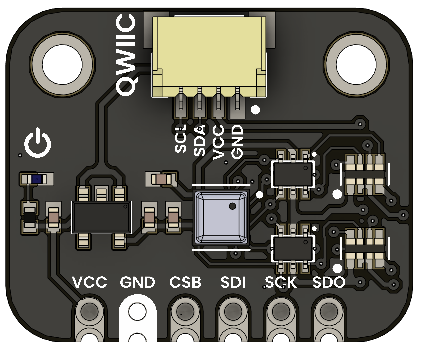
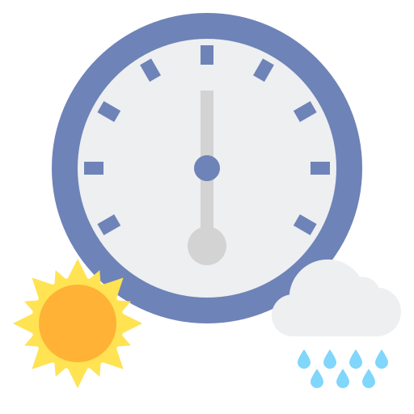

# BME688 Environmental Sensor 4-in-1

The **BME688 Environmental Sensor 4-in-1** is a versatile sensor module that combines temperature, humidity, pressure, and gas sensing capabilities in a single compact package. It utilizes the BME688 sensor from Bosch, which is known for its high accuracy and low power consumption. This module is ideal for applications in environmental monitoring, IoT devices, and smart home systems.

  
  
<em></em>

| Resource | Link |
|:--------:|:----:|
| Wiki-UNIT Electronics | [Wiki - UNIT Electronics](https://unit-electronics-mx.github.io/wiki_uelectronics/docs/Sensors/bme688) |
| Github Repository | [Github Repository](https://github.com/UNIT-Electronics-MX/unit_bme688_environmental_sensor_4_in_1) |
| Product Brief | [Product brief](hhttps://unit-electronics-mx.github.io/unit_bme688_environmental_sensor_4_in_1/datasheet_professional.html) |
| Schematic | [Schematic](https://unit-electronics-mx.github.io/unit_bme688_environmental_sensor_4_in_1/unit_sch_v_1_0_0_bme688_environmental_sensor_4_in_1.pdf) |

## 🔍 Key Sensor Features

Enhance your application with the sensor's robust capabilities:

| Feature                         | Icon                                                                                         | Description                                                                                |
|---------------------------------|----------------------------------------------------------------------------------------------|--------------------------------------------------------------------------------------------|
| Relative Humidity               |          | Accurately measures ambient moisture for precise environmental monitoring.               |
| Barometric Pressure             |           | Detects atmospheric pressure changes to support dynamic weather tracking.                |
| Excellent Temperature Stability |  | Delivers consistent temperature readings even under varying conditions.                  |
| Gas Sensing                     |               | Monitors a range of gases to help identify potential environmental hazards.              |

## 📦 Overview

| Feature                 | Description                      |
|-------------------------|----------------------------------|
| Sensor                  | BME688 Environmental Sensor      |
| Communication Protocol  | I2C and SPI                       |
| Power Supply            | 1.71V to 3.6V                     |

## 🧪 Use Cases

- **Environmental Monitoring**: Ideal for tracking air quality, humidity, temperature, and pressure in smart homes and industrial applications.
- **IoT Devices**: Can be integrated into IoT systems for real-time environmental data collection and analysis.
- **Weather Stations**: Useful in DIY weather stations for accurate weather forecasting and monitoring.
- **Smart Agriculture**: Helps in monitoring soil and air conditions to optimize crop growth and yield.
- **Wearable Devices**: Can be used in health and fitness wearables to monitor

## 🚀 Getting Started

1. **Connect** the board via USB-C to your computer.
2. **Install** the appropriate board package for:
   - Arduino IDE
   - PlatformIO
   - ESP-IDF / Pico SDK
3. **Flash** a sample project or use one from `/Software/examples`
4. **Power** via USB or external battery (if supported)

## 📚 Resources

- [Schematic Diagram](hardware/schematic.pdf)
- [Board Dimensions (DXF)](docs/dimensions.dxf)
- [Pinout Diagram](docs/pinout.png)
- [Firmware Examples](firmware/)
- [Getting Started Guide](docs/getting_started.md)

## 📝 License

All hardware and documentation in this project are licensed under the **MIT License**.  
Please refer to [`LICENSE.md`](LICENSE.md) for full terms.

  Template created by UNIT Electronics 

