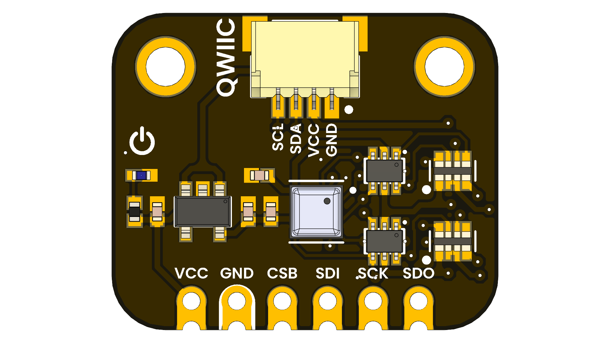

# BME688 Environmental Sensor 4-in-1

## Introduction
The BME688 Environmental Sensor 4-in-1 is a compact module that integrates temperature, humidity, barometric pressure, and gas sensing (including VOCs and IAQ) in a single package. Based on Bosch Sensortec technology, it offers digital I²C/SPI interfaces for easy integration with platforms like Arduino, ESP32, and Raspberry Pi. Its low power consumption and small size make it ideal for wearables, portable devices, and IoT applications. The sensor also supports AI-based gas classification via Bosch’s BME AI-Studio, enabling advanced air quality monitoring.

  
  
<em></em>

### Quick Setup

## 📦 Overview

| Parameter                | Value/Description                                 |
|--------------------------|---------------------------------------------------|
| Operating Voltage        | 1.71V to 3.6V                                     |
| Supply Current           | 0.9 µA (sleep), 2.1 µA (ULP), ~920 µA (gas scan)  |
| Operating Temperature    | -40°C to +85°C                                    |
| Relative Humidity Range  | 0% to 100% RH                                     |
| Pressure Range           | 300 hPa to 1100 hPa                               |
| Gas Sensing              | VOCs, IAQ index via integrated gas sensor         |
| Interfaces               | I²C and SPI (up to 3.4 MHz)                       |
| Package Size             | 3.0 × 3.0 × 0.93 mm³                              |

## Key Features

- **Relative Humidity**: Accurately measures ambient moisture for precise environmental monitoring.
- **Barometric Pressure**: Detects atmospheric pressure changes to support dynamic weather tracking.
- **Excellent Temperature Stability**: Delivers consistent temperature readings even under varying conditions.
- **Gas Sensing**: Monitors a range of gases to help identify potential environmental hazards.
- **Power Consumption:** Optimized for low power usage, making it ideal for battery-operated devices.
- **Interfaces:** I²C and SPI
- **Input Voltage via VCC Pin:** 3.6–6.0 V (through onboard voltage regulator)

## 🧪 Use Cases

- **Environmental Monitoring:** Tracks air quality, humidity, temperature, and pressure in smart homes and industrial settings.
- **IoT Devices:** Integrates into IoT systems for real-time environmental data collection and analysis.
- **Weather Stations:** Enables accurate weather forecasting and monitoring in DIY weather station projects.
- **Smart Agriculture:** Monitors soil and air conditions to optimize crop growth and yield.
- **Wearable Devices:** Supports health and fitness wearables for environmental parameter monitoring.

## 📚 Resources

- [<a href="./hardware/unit_sch_v_1_0_0_bme688_environmental_sensor_4_in_1.pdf">Schematic Diagram</a>](hardware/schematic.pdf)
- [<a href="./hardware/resources/unit_dimension_v_1_0_0_bme688_environmental_sensor_4_in_1.png">Board Dimensions (DXF)](docs/dimensions.dxf)
- [<a href="./hardware/resources/unit_pinout_v_0_0_1_ue0095_bm3688_4_in_1_es.png">Pinout Diagram</a>](docs/pinout.png)
- [Firmware Examples](firmware/)
- [Getting Started Guide](docs/getting_started.md)

## 📝 License

All hardware and documentation in this project are licensed under the **MIT License**.  
Please refer to [`LICENSE.md`](LICENSE.md) for full terms.

  Template created by UNIT Electronics 

