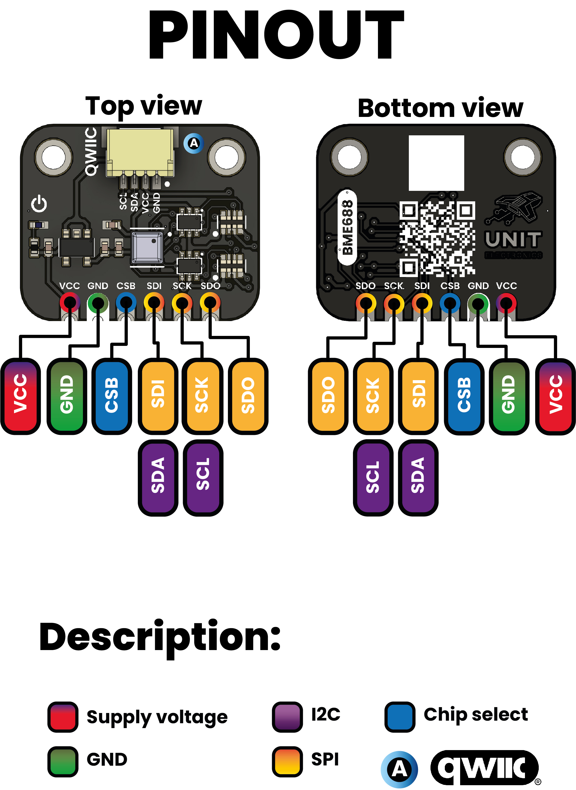

# Pinout

    
<a href="#">  Pinout</a>

     
     

| Pin Label | Function         | Notes                             |
|-----------|------------------|-----------------------------------|
| VCC       | Power Supply     | 3.3V or 5V                        |
| GND       | Ground           | Common ground for all components  |

