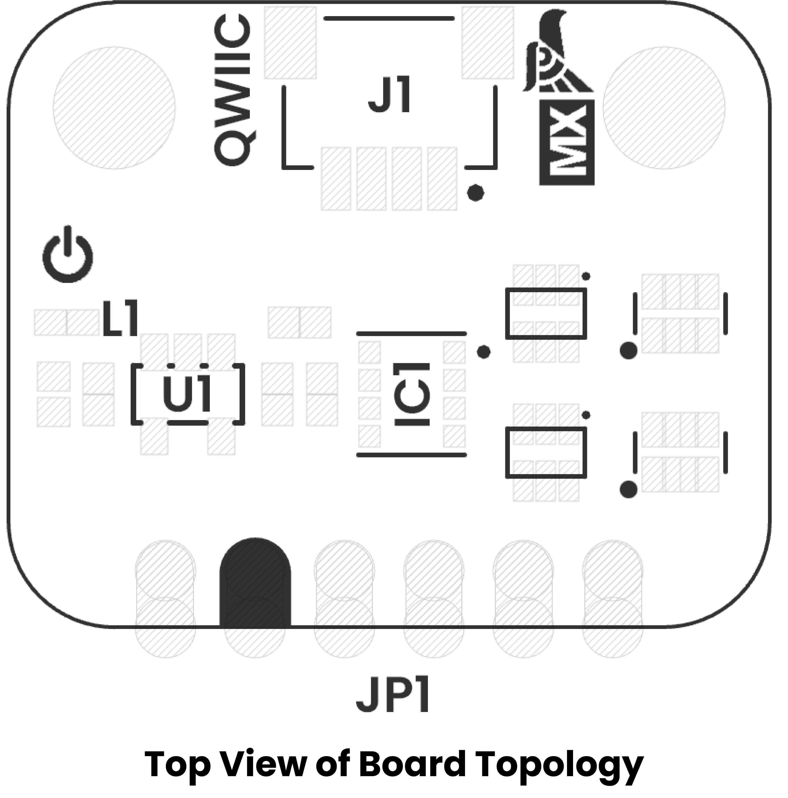

# Topology

<a href="../resources/unit_topology_v_1_0_0_bme688_environmental_sensor_4_in_1.png">  Topology</a>

 
    

| Ref. | Description                              |
|------|------------------------------------------|
| IC1  | BME688 Environmental Sensor              |
| L1   | Power On LED                             |
| U1   | AP2112K 3V3 Regulator                    | 
| JP1  | 2.54 mm Castellated Holes                |
| J1   | QWIIC Connector (JST 1 mm pitch) for I2C |
  

