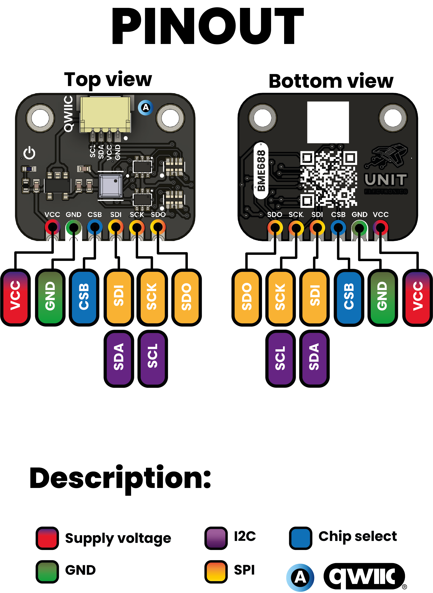
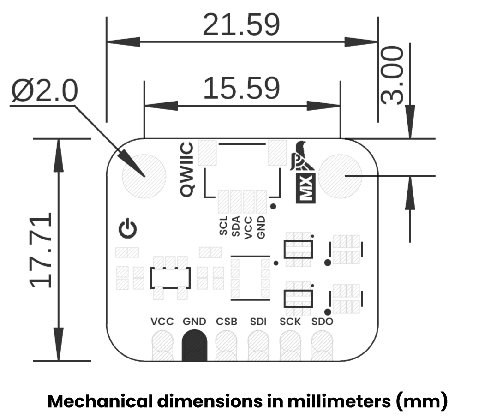
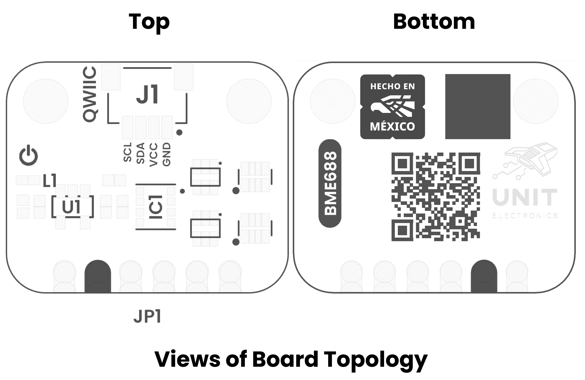

# Hardware

<a href="./unit_sch_V_0_0_1_ue0095_BME688.pdf">  Schematics</a>

---

## ⚙️ Technical Specifications

| Parameter                                       | Technical Data                                             |
|-------------------------------------------------|------------------------------------------------------------|
| Package dimensions                              | 8-Pin LGA with metal 3.0 x 3.0 x 0.93 mm³               |
| Operation range (full accuracy)                 | Pressure: 300...1100 hPa Humidity: 0…100% Temperature: -40…85°C |
| Supply voltage VDDIO                            | 1.2 ... 3.6 V                                              |
| Supply voltage VDD                              | 1.71 ... 3.6 V                                             |
| Interface                                       | I²C and SPI                                                |
| Average current consumption                     | 2.1 µA at 1 Hz humidity and temperature 3.1 µA at 1 Hz pressure and temperature 3.7 µA at 1 Hz humidity, pressure and temperature 90 µA at ULP mode for p/h/T &amp; air quality 0.9 mA at LP mode for p/h/T &amp; air quality 3.9 mA in standard gas scan mode (gas scan mode &amp; scan rate can be optimized on applications with BME AI studio) |
| Gas sensor - F1 score for H₂S scanning          | 0.94                                                       |
| Gas sensor - Standard scan speed                | 10.8 s / scan                                              |
| Gas sensor - Electric charge for standard scan  | 0.18 mAh (5 scans ~ 1 min)                                 |
| Gas sensor - Response time (τ 33-63%)           | &lt; 1 s (for new sensors)                                 |
| Gas sensor - Sensor-to-sensor deviation         | +/- 15%                                                    |
| Gas sensor - Power consumption                  | &lt; 0.1 mA in ultra-low power mode                        |
| Gas sensor - Output data processing             | Major direct outputs: Index for Air Quality (IAQ), bVOC-&amp; CO₂-equivalents (ppm), Gas scan result (%) &amp; many more (all listed in datasheet in Table 20: BSEC outputs)                                                                                                       |
| Humidity sensor - Response time (τ0-63%)        | 8 s                                                        |
| Humidity sensor - Accuracy tolerance            | ± 3 % relative humidity                                    |
| Humidity sensor - Hysteresis                    | ≤ 1.5 % relative humidity                                  |
| Pressure sensor - RMS Noise                     | 0.12 Pa (equiv. to 1.7 cm)                                 |
| Pressure sensor - Sensitivity Error             | ± 0.25 % (equiv. to 1 m at 400 m height change)            |
| Pressure sensor - Temperature coefficient offset| ±1.3 Pa/K (equiv. to ±10.9 cm at 1°C temperature change)   |

## 🔌 Pinout

    <a href="#"> Pinout</a>
     
     

| Pin Label | Function         | Notes                             |
|-----------|------------------|-----------------------------------|
| VCC       | Power Supply     | 3.3V or 5V                        |
| GND       | Ground           | Common ground for all components  |

## 📏 Dimensions

<a href="./resources/unit_dimension_v_1_0_0_bme688_environmental_sensor_4_in_1.png">  Dimensions</a>

## 📃 Topology

<a href="./resources/unit_topology_v_1_0_0_bme688_environmental_sensor_4_in_1.png">  Topology</a>

 
    

| Ref. | Description                              |
|------|------------------------------------------|
| IC1  | BME688 Environmental Sensor              |
| L1   | Power On LED                             |
| U1   | AP2112K 3V3 Regulator                    | 
| JP1  | 2.54 mm Castellated Holes                |
| J1   | QWIIC Connector (JST 1 mm pitch) for I2C |
  

