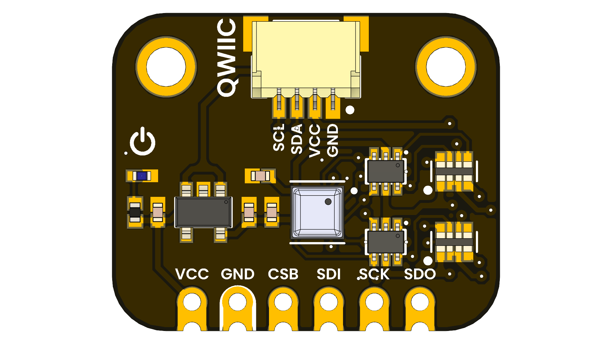

<!--
# README_TEMPLATE.md
This file serves as an input to generate a datasheet-style technical PDF.
Fill in each section without deleting or modifying the existing headings.
-->

# BME688 Environmental Sensor 4-in-1

 

## Introduction

The BME688 Environmental Sensor 4-in-1 is a versatile sensor module that combines temperature, humidity, pressure, and gas sensing capabilities in a single compact package. 

## Functional Description

- Accurately measures ambient moisture for precise environmental monitoring.
- Detects atmospheric pressure changes to support dynamic weather tracking.
- Delivers consistent temperature readings even under varying conditions.
- Monitors a range of gases to help identify potential environmental hazards.

## Electrical Characteristics & Signal Overview

- Power supply: 1.71V to 3.6V
- Low power consumption: sleep < 0.1 µA, typical operation < 3 µA

## Applications

- Environmental Monitoring: Ideal for tracking air quality, humidity, temperature, and pressure in smart homes and industrial applications.
- IoT Devices: Can be integrated into IoT systems for real-time environmental data collection and analysis.
- Weather Stations: Useful in DIY weather stations for accurate weather forecasting and monitoring.
- Smart Agriculture: Helps in monitoring soil and air conditions to optimize crop growth and yield.
- Wearable Devices: Can be used in health and fitness wearables to monitor

## Features

- Temperature measurement: –40 to +85 °C, ±0.5 °C accuracy  
- Humidity measurement: 0 to 100 % RH, ±3 % accuracy  
- Barometric pressure: 300 to 1100 hPa, ±1 hPa accuracy  
- VOC detection: Indoor Air Quality (IAQ) index  
- Dual interface: I²C (Qwiic) and SPI      
- Compact form factor: Qwiic connector + standard through-hole pins 

## Pin & Connector Layout

| Group     | Available Pins                                 | Suggested Use                                     |
|-----------|------------------------------------------------|---------------------------------------------------|
| GPIO      | –                                              | Not applicable                                    |
| UART      | –                                              | Not supported                                     |
| TouchPad  | –                                              | Not supported                                     |
| Analog    | –                                              | Not supported                                     |
| SPI       | CSB, SDI (MOSI), SDO (MISO), SCK               | High-speed SPI to read sensor data                |
| I²C       | SDA, SCL (via Qwiic connector)                 | Standard I²C for configuration & data acquisition |

## Settings

### Interface Overview

| Interface | Signals / Pins                          | Typical Use                          |
|-----------|-----------------------------------------|--------------------------------------|
| UART      | –                                       | Unavailable                          |
| I²C       | SDA, SCL  (CSB held high)               | Default interface (Qwiic connector)  |
| SPI       | CSB = GND, SDI (MOSI), SCK, SDO (MISO)  | High-speed alternative               |
| USB       | –                                       | Unavailable on this module           |

### Supports

| Symbol | I/O         | Description                        |
|--------|-------------|------------------------------------|
| VCC    | Input       | 3.3V or 5V                         |
| GND    | GND         | Common ground for all components   |

## Block Diagram

 <!-- FILL HERE: replace image if needed -->

## Dimensions

 <!-- FILL HERE: replace image if needed -->

## Usage

This module works with multiple platforms and toolchains:

- Arduino IDE (Adafruit BME680/BME688 library)  
- PlatformIO (Arduino or Espressif frameworks)  
- Raspberry Pi / Python (Adafruit CircuitPython-BME680)  
- MicroPython (I²C/SPI firmware)  
- ESP32 / ESP8266 (Arduino or ESP-IDF)

## Downloads

<!-- FILL HERE -->
- [Schematic PDF](docs/schematic.pdf)
- [Board Dimensions DXF](docs/dimensions.dxf)
- [Pinout Diagram PNG](docs/pinout.png)

## Purchase

<!-- FILL HERE -->
- [Buy from vendor](https://example.com)
- [Product page](https://example.com/product/template-board)
