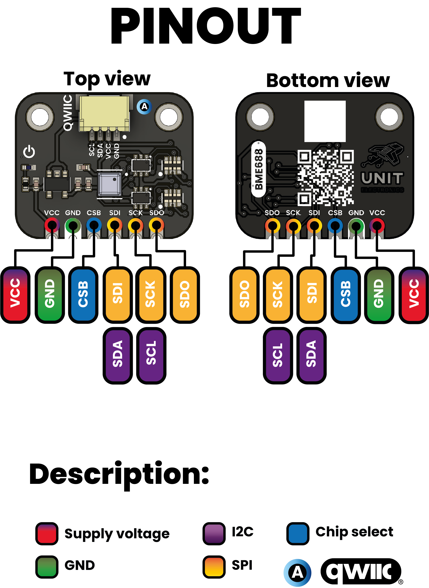
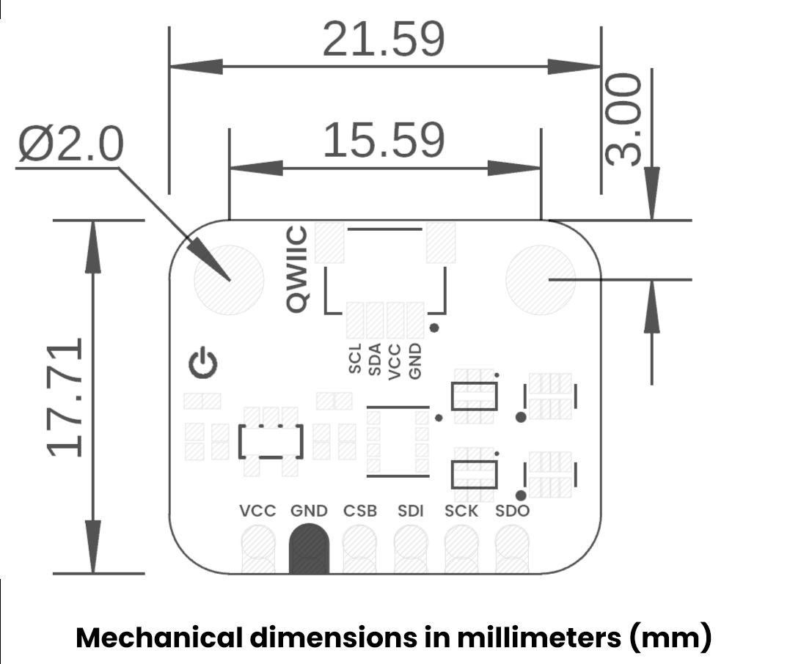

<!--
# README_TEMPLATE.md
This file serves as an input to generate a datasheet-style technical PDF.
Fill in each section without deleting or modifying the existing headings.
-->

# BME688 Environmental Sensor 4-in-1

 

## Pin & Connector Layout

| Group     | Available Pins                                 | Suggested Use                                     |
|-----------|------------------------------------------------|---------------------------------------------------|
| SPI       | CSB, SDI (MOSI), SDO (MISO), SCK               | High-speed SPI to read sensor data                |
| I²C       | SDA, SCL (via Qwiic connector)                 | Standard I²C for configuration & data acquisition |

## Settings

### Interface Overview

| Interface | Signals / Pins                          | Typical Use                          |
|-----------|-----------------------------------------|--------------------------------------|
| UART      | –                                       | Unavailable                          |
| I²C       | SDA, SCL  (CSB held high)               | Default interface (Qwiic connector)  |
| SPI       | CSB = GND, SDI (MOSI), SCK, SDO (MISO)  | High-speed alternative               |
| USB       | –                                       | Unavailable on this module           |

### Supports

| Symbol | I/O         | Description                        |
|--------|-------------|------------------------------------|
| VCC    | Input       | 3.3V or 5V                         |
| GND    | GND         | Common ground for all components   |

## Block Diagram

 <!-- FILL HERE: replace image if needed -->

## Dimensions

 <!-- FILL HERE: replace image if needed -->
